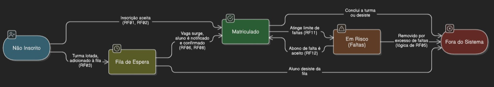

# RF02: Verificar Elegibilidade para Matrícula em Turma

**Descrição:** O sistema deve verificar a elegibilidade do aluno, assegurando que a turma tenha vagas disponíveis e que o aluno não esteja matriculado em nenhuma outra turma, antes de efetivar sua matrícula.

**Origem:** Entrevista com Alexandre

**Prioridade:** Alta

