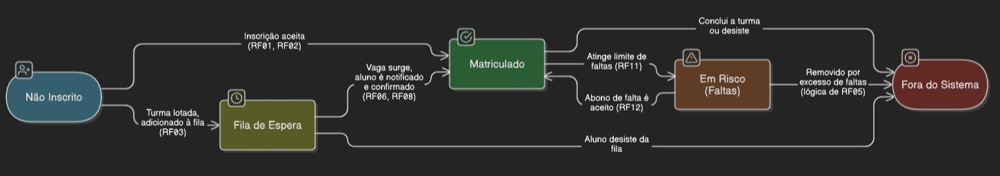

# Notificação de Vaga Desocupada

**Descrição:** O sistema deve notificar, por e-mail e WhatsApp, a primeira pessoa da lista de espera para uma turma, quando uma vaga for desocupada na respectiva turma.

**Origem:** Entrevista com Alexandre

**Prioridade:** alta

